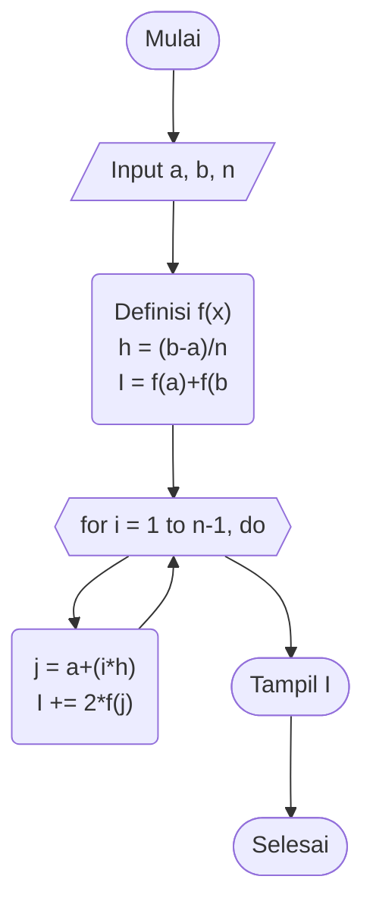
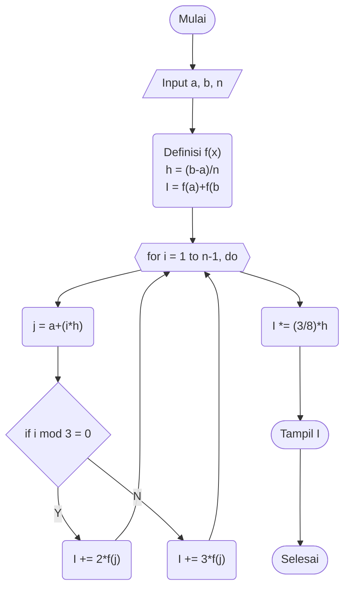

# KN-M7

## Metode Trapesium

```mermaid
graph TD;
    A([Mulai])-->B[/Input a, b, n/];
    B-->C("Definisi f(x)<br>h = (b-a)/n<br>I = f(a)+f(b");
    C-->D{{for i = 1 to n-1, do}};
    D-->E("j = a+(i*h)<br>I += 2*f(j)");
    E-->D;
    D-->F([Tampil I]);
    F-->G([Selesai]);
```

## Metode 1/3 Simpson

```mermaid
graph TD;
    A([Mulai])-->B[/Input a, b, n/];
    B-->C("Definisi f(x)<br>h = (b-a)/n<br>I = f(a)+f(b");
    C-->D{{for i = 1 to n-1, do}};
    D-->E("j = a+(i*h)");
    E-->F{if i mod 2 = 0};
    F--Y-->G("I += 2*f(j)");
    F--N-->H("I += 4*f(j)");
    G-->D;
    H-->D;
    D-->I(I *= h/3);
    I-->J([Tampil I]);
    J-->K([Selesai]);
```

## Metode 3/8 Simpson

```mermaid
graph TD;
    A([Mulai])-->B[/Input a, b, n/];
    B-->C("Definisi f(x)<br>h = (b-a)/n<br>I = f(a)+f(b");
    C-->D{{for i = 1 to n-1, do}};
    D-->E("j = a+(i*h)");
    E-->F{if i mod 3 = 0};
    F--Y-->G("I += 2*f(j)");
    F--N-->H("I += 3*f(j)");
    G-->D;
    H-->D;
    D-->I("I *= (3/8)*h");
    I-->J([Tampil I]);
    J-->K([Selesai]);
```
